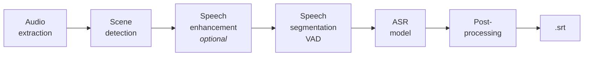

# WhisperJAV

<p align="center">
  <a href="https://colab.research.google.com/github/meizhong986/WhisperJAV/blob/main/notebook/WhisperJAV_colab_edition_expert.ipynb">
    
  </a>
  <a href="https://kaggle.com/kernels/welcome?src=https://github.com/meizhong986/WhisperJAV/blob/main/notebook/WhisperJAV_kaggle_parallel_edition.ipynb">
    
  </a>
  <a href="https://buymeacoffee.com/meizhong">
    
  </a>
</p>

A subtitle generator for Japanese Adult Videos. Free, runs on your own machine, no cloud upload of your media.

**Documentation:** [English](https://meizhong986.github.io/WhisperJAV/) | [简体中文](https://meizhong986.github.io/WhisperJAV/zh/)

---

## The idea

Speech recognition models like Whisper are trained on clean, curated speech. JAV audio is the opposite of that, and the mismatch breaks them in specific, well-understood ways:

1. **The acoustic profile.** JAV audio has a low signal-to-noise ratio and a high density of non-verbal vocalisations — breathing, gasps, moans — whose spectra often mimic real Japanese syllables (e.g. *fu*), tricking the model into hearing words where none exist. Add extreme volume swings (whispers to screams) and theatrical role language (*yakuwarigo*) absent from training corpora, and the model's assumptions stop holding.

2. **Long-form drift and hallucination.** These are feature-length recordings, not 30-second clips. Over long stretches of ambiguous audio — silence, rhythmic breathing — the model's attention collapses and it fills the void with repeated or invented text. This is a documented failure mode of Whisper-family models [3, 4, 5].

3. **The pre-processing paradox.** Intuition says "denoise first". In practice, blanket denoising and vocal isolation can strip the high-frequency detail the model needs to tell consonants apart, making things worse. Fine-tuning on JAV data has its own trap: good datasets are scarce, so fine-tuned models tend to overfit and become hit-or-miss.

WhisperJAV is built around these three failure points rather than around any single model:

- **Scene-based segmentation** — split the audio at natural acoustic boundaries so the model always processes a coherent environment, never a mixed stream [1, 2].
- **VAD clamping** — detect where speech actually is, and feed the model only that, with measured padding. This is the main defence against hallucination on non-speech.
- **Defensive decoding and post-processing** — tuned confidence thresholds discard low-quality output, and Japanese-aware filters clean what remains.

None of this is magic; it is careful plumbing around known model weaknesses, and the defaults are tuned against ground-truth benchmarks. Results still vary with source audio quality.

---

## Quick start

**GUI** (recommended): launch **WhisperJAV** from the desktop shortcut (Windows installer) or run:

```bash
whisperjav-gui
```

Add files, pick a mode, click Start. Subtitles land next to your video as `.srt`.

**Command line:**

```bash
whisperjav video.mp4                                        # defaults
whisperjav video.mp4 --mode balanced --sensitivity aggressive
whisperjav /path/to/folder --output-dir ./subtitles         # whole folder
```

Any input FFmpeg can read works: MP4, MKV, AVI, WMV, MP3, WAV, FLAC, and so on. Output is SRT (default), WebVTT, or both (`--output-format both`).

---

## How a video becomes subtitles

Every pipeline follows the same overall shape; modes differ in which components they use and how aggressively they are tuned.



- **Scene detection** splits the audio at natural breaks instead of fixed-length chunks, so sentences are not cut mid-word and each chunk has consistent acoustics.
- **Speech enhancement** (off by default) can clean audio per-scene — used surgically, per the pre-processing paradox above.
- **Speech segmentation (VAD)** finds where speech actually is inside each scene. This choice matters more than most settings: it decides what the model hears and, in the modern pipelines, where your subtitle timestamps come from.
- **The ASR model** turns speech into text.
- **Post-processing** is the Japanese-specific cleanup pass:
  - Sentence regrouping aware of ending particles (ね, よ, わ, の), aizuchi (うん, はい), and dialect patterns (Kansai-ben and others)
  - Hallucination and repetition removal
  - Sound-only line removal — subtitle lines that are purely moans/breathing kana are dropped (real dialogue is protected by an evidence check)
  - Timing repair — a subtitle whose duration is absurdly long for its text gets its start pulled in (the end stays put); the console reports how many lines were retimed
  - Scene-boundary overlap resolution

Each stage has several interchangeable providers — the full menu, with strengths and weaknesses, is in [Mix-and-match strategies](#mix-and-match-strategies) below.

---

## Processing modes

| Mode | Engine | Character |
|---|---|---|
| **balanced** | Faster-Whisper | Default. Full pipeline; good speed/accuracy balance |
| **fidelity** | OpenAI Whisper | Slowest, most thorough of the classic pipelines |
| **fast** | OpenAI Whisper + scene detection | General use, mixed-quality audio |
| **faster** | Faster-Whisper, minimal preprocessing | Speed first, clean audio |
| **qwen** (ChronosJAV) | Qwen3-ASR | Modern text-first recognizer |
| **anime-whisper** (ChronosJAV) | anime-whisper | Anime/JAV-tuned dialogue |
| **transformers** | HuggingFace | Kotoba and other HF Whisper models |
| **crispasr** | External | Bring-your-own CrispASR build (experimental) |

**Sensitivity** applies to every mode: **conservative** (fewer false positives, good for noisy content) · **balanced** · **aggressive** (catches more quiet dialogue; good for whisper/ASMR content — and the tuning target of most of our benchmark work).

### ChronosJAV

Some of the best recognizers for this domain (anime-whisper, Qwen3-ASR and its Japanese finetunes) don't produce reliable timestamps on their own. ChronosJAV runs text generation and timing as separate stages: the VAD provides the time skeleton, the model provides the words. Since v1.9, timestamps come from the VAD frames by default (no aligner model loaded, ~1 GB less VRAM); a Qwen forced-aligner mode remains available in the settings for word-level alignment.

The same decoupled design is why new models can be added without rebuilding the pipeline — anything that turns audio into text can be slotted in.

---

## Two-pass ensemble

Different pipelines miss different lines. Ensemble mode runs your file through two pipelines and merges the results.

**The v1.9 default pairing:** pass 1 = **anime-whisper** with WhisperSeg VAD, pass 2 = **Qwen3-ASR** with TEN VAD — two different recognizers *and* two different VADs, so their blind spots don't overlap.

```bash
whisperjav video.mp4 --ensemble \
    --pass1-pipeline qwen --pass2-pipeline balanced \
    --merge-strategy pass1_primary
```

- **Merge strategies:** `pass1_primary` / `pass2_primary` (one pass leads, the other fills gaps), `smart_merge`, `full_merge`, `pass1_overlap` / `pass2_overlap`, `longest`
- **Presets:** save and reload named ensemble configurations from the GUI
- **Serial mode** (`--ensemble-serial`): finish each file completely before starting the next, so results appear as they're done
- **Bring your own pass 2:** [PurfView's Faster-Whisper XXL](https://github.com/Purfview/whisper-standalone-win) (`--pass2-pipeline xxl --xxl-exe ...`) or an external CrispASR build

---

## Mix-and-match strategies

The Ensemble tab is a mixing desk. Each pass is a free combination of five choices — **pipeline × scene detection × audio pre-processing × speech segmentation × ASR model** — and the two-pass design is the sixth dimension. The defaults are benchmark-tuned, so you never *have* to touch any of this; but audio varies a lot, and one deliberate substitution is often worth the experiment. The golden rule: **change one thing at a time**, so you know what caused the difference.

### Pipeline

The recipe that ties the other choices together.

| Pipeline | Strength | Watch out |
|---|---|---|
| **balanced** | The workhorse: full pipeline, good speed/accuracy, every component swappable | Jack of all trades — specialists beat it on their home turf |
| **fidelity** | Most thorough classic pipeline; strong on quiet/ASMR content | Slowest option |
| **fast** | Decent middle ground on mixed-quality audio | Fewer defences than balanced |
| **faster** | Speed; fine for clean, dialogue-forward audio | Minimal preprocessing = less hallucination protection |
| **qwen** (ChronosJAV) | Modern text-first recognizer; robust on messy audio | Timestamps come from the VAD, so the segmenter choice matters doubly |
| **anime-whisper** (ChronosJAV) | Best-in-class on anime-style/JAV dialogue; heavily benchmark-tuned here | Can miss very faint, isolated utterances |
| **transformers** | Runs any HF Whisper model; best GPU path on Apple Silicon | Uses HF's own chunking — scene/segmenter choices don't apply |
| **crispasr** / **xxl** | Bring your own external engine as a pass | Self-contained: WhisperJAV's knobs don't reach inside |

### Scene detection

Where the long file gets cut into workable pieces.

| Method | Strength | Watch out |
|---|---|---|
| **Semantic** | Groups acoustically similar audio; best for full-length features; ChronosJAV default | Occasionally cuts inside speech on very uniform audio |
| **Auditok** | Energy-based: fast, simple, dependable | Constant background music can mask the pauses it needs |
| **Silero** | Neural; holds up on noisy audio | Slower than auditok |
| **None** | No cutting at all | Only sensible for short clips |

### Audio pre-processing (speech enhancement)

Off by default — remember the pre-processing paradox. The **"Enhance for VAD only"** checkbox is the safest way to use these: the cleaned audio guides speech detection while the model still hears the original.

| Backend | Strength | Watch out |
|---|---|---|
| **none** | No artefacts, no surprises — the right default | Won't rescue genuinely bad audio |
| **ffmpeg-dsp** | Transparent classic filters (loudnorm, denoise, compress…); loudnorm genuinely helps very quiet recordings | Aggressive settings dull consonants |
| **zipenhancer** | Lightweight neural denoise; good against hiss | 16 kHz processing; can soften detail |
| **clearvoice** | Stronger neural denoise, up to 48 kHz | Heavier; artefact risk on music-heavy audio |
| **bs-roformer** | Vocal isolation — separates voice from loud BGM | The biggest intervention of all; reserve for music-dominated content |

### Speech segmentation (VAD)

Decides what the model hears — and in ChronosJAV pipelines, where your timestamps come from. Probably the highest-leverage swap on this list.

| Backend | Strength | Watch out |
|---|---|---|
| **WhisperSeg** | Trained on Japanese ASMR-style audio; tuned against our ground truth; the JA default | Japanese-specialised — switch it for other languages |
| **TEN VAD** | Light and quick; good general performer; pass-2 default for diversity | Less JA-specialised than WhisperSeg |
| **Silero v3.1 / v4.0** | Solid general-purpose; the recommendation for non-Japanese audio | Tends to miss very quiet Japanese speech |
| **Silero v6.2** | Adds max-duration splitting and finer control | Same quiet-speech caveat |
| **Faster-Whisper native** | Fastest — one recognizer call per scene | Coarser timing than a dedicated VAD |
| **FireRedVAD** *(new, experimental)* | Tiny multilingual model, cheap on CPU; early access for feedback | Presets not yet JAV-tuned; needs `pip install fireredvad` |
| **None** | The model hears everything | Maximum hallucination exposure on non-speech |

### ASR engine and model

| Model | Pipeline | Strength | Watch out |
|---|---|---|---|
| **Whisper large-v2** | classic | The most predictable performer on this domain — that's why it's the default | Not the newest |
| Whisper large-v3 | classic | Newer training | More hallucination-prone on JAV audio |
| Whisper turbo | classic | Fastest Whisper | Some accuracy cost |
| **whisper-ja-1.5B** (CT2) *(new)* | balanced | JA finetune, word timestamps intact; strongest results in our scene-length benchmarks | Community model; occasional repetitions (our filters catch most) |
| **anime-whisper** | ChronosJAV | Excellent anime/JAV dialogue quality | No native timestamps — VAD-timed |
| **Qwen3-ASR 1.7B / 0.6B** | ChronosJAV | Robust on messy audio; 0.6B fits 4 GB VRAM | No native timestamps — VAD-timed |
| **JA Anime-Galgame 1.7B** *(new)* | ChronosJAV | Qwen finetune with published gains on anime speech (CER −27% rel.); recovers lines the base drops | Slightly more junk insertions (post-processing handles most) |
| **JA-tuned 1.7B (neosophie)** *(new)* | ChronosJAV | Qwen finetune aimed at proper nouns and kanji-heavy phrasing | No published benchmarks |
| **Kotoba family** | transformers | Japanese-optimized, light; bilingual variant; good on Apple Silicon | Smaller models — ceiling below the 1.5B+ class |

### The two-pass dimension

Everything above multiplies: two passes means two full recipes, then a merge. What makes a *good* pair is diversity — different recognizers **and** different VADs, so the passes fail in different places and the merge covers both.

A few known-good recipes:

| Goal | Pass 1 | Pass 2 | Merge |
|---|---|---|---|
| The v1.9 default | anime-whisper · semantic · WhisperSeg · aggressive | Qwen3-ASR · semantic · TEN | `pass1_primary` |
| Classic + modern | balanced · large-v2 | qwen (or the Anime-Galgame finetune) | `pass1_primary` |
| Quiet/ASMR recall | fidelity · aggressive | anime-whisper · aggressive | `longest` |
| Second opinion on the model only | your usual recipe | same recipe, different ASR model | `pass1_primary` |

Merge-strategy rule of thumb: `pass1_primary` when you trust pass 1 and want gap-filling; `longest` when you're chasing completeness; `smart_merge` when both passes are of similar quality. Save anything that works as a **preset** so it's one click next time.

---

## AI translation

Generate and translate in one go, or translate subtitles you already have:

```bash
whisperjav video.mp4 --translate                      # transcribe + translate
whisperjav-translate -i subtitles.srt --provider ollama
```

| Provider | Cost | Notes |
|---|---|---|
| **Ollama** | free, local | Recommended local option; auto-starts the server and picks a model for your VRAM |
| DeepSeek | cheap | Good quality/price for this content |
| Gemini | free tier | |
| Claude / GPT / OpenRouter / GLM / Groq | paid API | |
| Local LLM (llama-cpp) | free, local | Legacy option; auto-installs on first use |

Interrupted translations resume where they left off — just run the same command again.

---

## The GUI

Four tabs:

1. **Transcribe** — files, mode, sensitivity, language
2. **Advanced options** — output format, scene detection, model override, debug
3. **Ensemble** — the two-pass grid: per-pass pipeline, sensitivity, scene detector, enhancer, VAD, and model, plus a Customize dialog exposing each backend's tunable parameters, and preset save/load
4. **AI SRT Translate** — translate existing subtitle files

Sensible defaults everywhere: if you never open a Customize dialog, you get the benchmark-tuned configuration.

---

## Which mode for which content

| Content | Suggestion | Sensitivity |
|---|---|---|
| Dialogue-heavy drama | balanced | aggressive |
| Anime-style / clear JAV dialogue | anime-whisper | aggressive |
| ASMR / whispering / VR | fidelity or anime-whisper | aggressive |
| Heavy background music | balanced | conservative |
| Amateur / variable audio | fast | conservative |
| Group scenes | faster | conservative |
| Best possible result | ensemble (anime-whisper + qwen) | per-pass defaults |

These are starting points, not rules — see [Mix-and-match strategies](#mix-and-match-strategies) for how to adapt them.

---

## Installation

> **Already installed?** Upgrade with `whisperjav-upgrade` (all platforms). Rollback is available: `whisperjav-upgrade --rollback`.

### Windows — standalone installer (recommended)

No Python knowledge needed.

1. Download the `.exe` from [**Releases**](https://github.com/meizhong986/WhisperJAV/releases/latest)
2. Run it — no admin rights required (installs to `%LOCALAPPDATA%\WhisperJAV`)
3. Wait 10–20 minutes while it sets up Python, PyTorch, FFmpeg and dependencies. It detects your NVIDIA driver and installs the matching CUDA build automatically (or CPU-only if no GPU)
4. Launch from the desktop shortcut. First transcription downloads models (~3 GB)

### Google Colab / Kaggle

No local install at all — use the badges at the top of this page. Maintained notebooks for both platforms.

<details>
<summary><b>Windows — install from source</b></summary>

Prerequisites: Python 3.10–3.12, Git, FFmpeg in PATH.

```batch
git clone https://github.com/meizhong986/whisperjav.git
cd whisperjav
installer\install_windows.bat            :: auto-detects GPU
installer\install_windows.bat --cpu-only :: or force CPU
```

Full guide: [docs/en/guides/installation_windows_python.md](docs/en/guides/installation_windows_python.md)
</details>

<details>
<summary><b>macOS (Apple Silicon)</b></summary>

```bash
xcode-select --install
brew install python@3.12 ffmpeg portaudio git

git clone https://github.com/meizhong986/whisperjav.git
cd whisperjav
python3 -m venv ~/venvs/whisperjav && source ~/venvs/whisperjav/bin/activate
chmod +x installer/install_mac.sh && ./installer/install_mac.sh
```

M-series chips get MPS acceleration for Whisper pipelines (`--mode transformers` performs best). The CTranslate2-based modes and the Qwen pipeline currently run on CPU on Mac. Intel Macs are CPU-only.

Full guide: [docs/en/guides/installation_mac_apple_silicon.md](docs/en/guides/installation_mac_apple_silicon.md)
</details>

<details>
<summary><b>Linux</b></summary>

Install system packages first (Ubuntu example; see the guide for Fedora/Arch):

```bash
sudo apt-get install -y python3 python3-pip python3-venv python3-dev \
    build-essential ffmpeg git libsndfile1 libsndfile1-dev
```

Then:

```bash
git clone https://github.com/meizhong986/whisperjav.git
cd whisperjav
chmod +x installer/install_linux.sh && ./installer/install_linux.sh
```

You need the NVIDIA driver (450+), but not the CUDA Toolkit — PyTorch bundles its own runtime. GUI needs WebKit2GTK. On distros with externally-managed Python (Ubuntu 24.04+), use a venv; the script detects this and tells you what to do.

Full guide: [docs/en/guides/installation_linux.md](docs/en/guides/installation_linux.md)
</details>

<details>
<summary><b>Expert: pip with modular extras</b></summary>

Install PyTorch first (pick your platform):

```bash
pip install torch torchaudio --index-url https://download.pytorch.org/whl/cu128  # NVIDIA
pip install torch torchaudio                                                     # Apple Silicon
pip install torch torchaudio --index-url https://download.pytorch.org/whl/cpu    # CPU
```

Then WhisperJAV with the extras you want:

```bash
pip install "whisperjav[all] @ git+https://github.com/meizhong986/whisperjav.git"
```

Extras: `cli`, `gui`, `translate`, `llm`, `enhance`, `huggingface`, `analysis`, `colab`, `all`.
</details>

### System requirements

| | Minimum | Recommended |
|---|---|---|
| OS | Windows 10 / macOS 11 / Ubuntu 20.04 | Windows 11 / macOS 14 / Ubuntu 22.04 |
| Python (source installs) | 3.10 | 3.11 |
| RAM | 8 GB | 16 GB |
| Disk | 8 GB | 15 GB with models |
| GPU | none (CPU works, slowly) | NVIDIA RTX 2060+ or Apple Silicon |

Rough speed per hour of video: **RTX GPU** 5–10 min · **Apple Silicon** 8–15 min · **CPU** 30–60 min.

---

## Troubleshooting

- **"FFmpeg not found"** — install FFmpeg and add it to PATH.
- **Very slow, GPU warning in log** — your PyTorch is CPU-only. Reinstall it with the CUDA index URL shown above.
- **`model.bin` error in faster mode** — enable Windows Developer Mode (or run once as admin), then delete the cached model folder under `%USERPROFILE%\.cache\huggingface\hub`.
- Anything else: open a [GitHub issue](https://github.com/meizhong986/WhisperJAV/issues) with your system info and the console log. Logs and reproduction details make fixes much faster.

---

## Contributing

Contributions are welcome — see `CONTRIBUTING.md`. Development setup:

```bash
git clone https://github.com/meizhong986/whisperjav.git
cd whisperjav
pip install -e ".[dev]"
python -m pytest tests/
```

---

## License

MIT. See [LICENSE](LICENSE).

## References

1. Chen, Y., et al. (2025). "ChronusOmni: Improving Time Awareness of Omni Large Language Models." arXiv:2512.09841. *(Inspiration for the ChronosJAV pipeline)*
2. Bain, M., et al. (2023). "WhisperX: Time-Accurate Speech Transcription of Long-Form Audio." arXiv:2303.00747.
3. Wang, Y., et al. (2025). "Calm-Whisper: Reduce Whisper Hallucination On Non-Speech By Calming Crazy Heads Down." Interspeech 2025. arXiv:2505.12969.
4. Barański, M., et al. (2025). "Investigation of Whisper ASR Hallucinations Induced by Non-Speech Audio." arXiv:2501.11378.
5. Koenecke, A., et al. (2024). "Careless Whisper: Speech-to-Text Hallucination Harms." ACM FAccT 2024.
6. Roll, N., et al. (2025). "In-Context Learning Boosts Speech Recognition via Human-like Adaptation to Speakers and Language Varieties." arXiv:2505.14887.
7. Yang, X., et al. (2024). "PromptASR for Contextualized ASR with Controllable Style." ICASSP 2024. arXiv:2309.07414.

## Acknowledgments

Built on the shoulders of: [OpenAI Whisper](https://github.com/openai/whisper) · [faster-whisper](https://github.com/guillaumekln/faster-whisper) · [stable-ts](https://github.com/jianfch/stable-ts) · [Qwen3-ASR](https://github.com/QwenLM/Qwen3-ASR) · [anime-whisper](https://huggingface.co/litagin/anime-whisper) · [Kotoba-Whisper](https://huggingface.co/kotoba-tech/kotoba-whisper-v2.2) · [HuggingFace Transformers](https://github.com/huggingface/transformers) · [PySubtrans](https://github.com/machinewrapped/llm-subtrans) — and the testing community, whose feedback and bug reports shape every release.

## Disclaimer

This tool generates accessibility subtitles. Users are responsible for compliance with applicable laws regarding the content they process.
