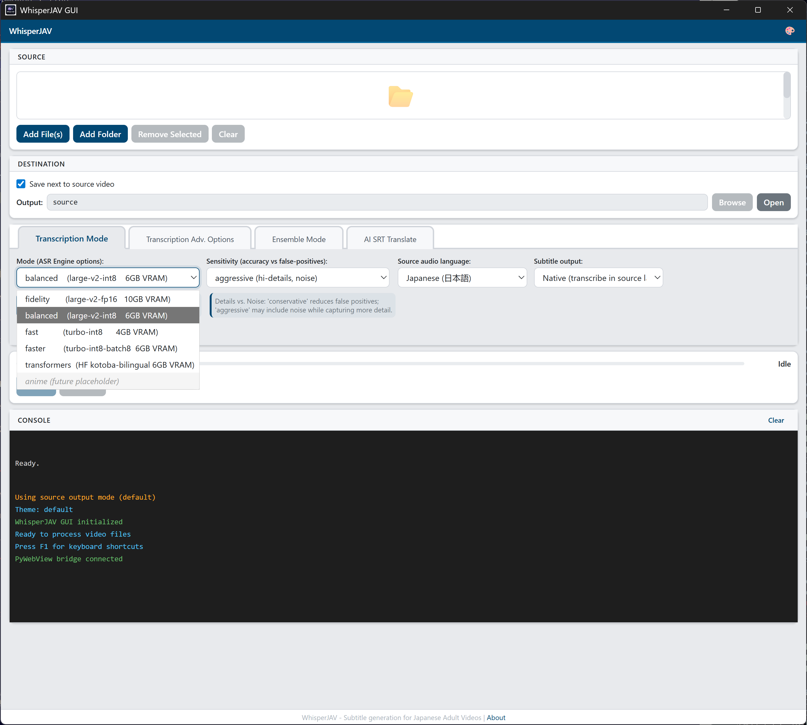
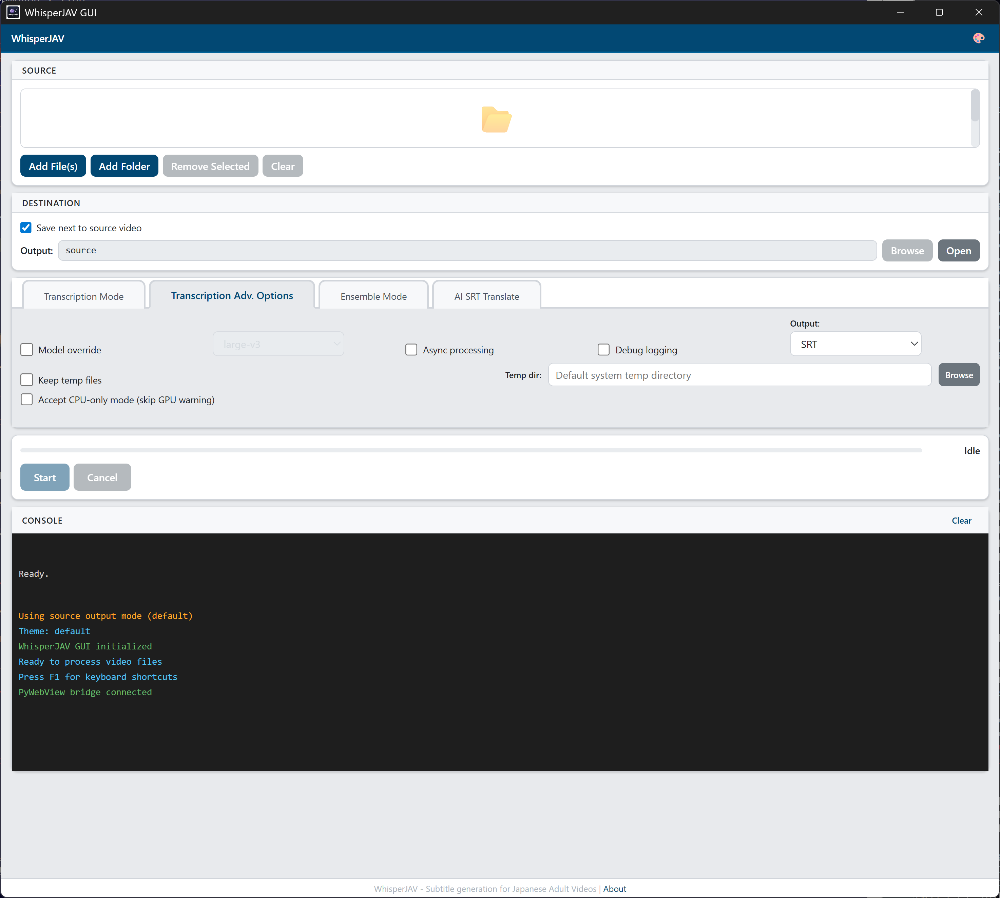
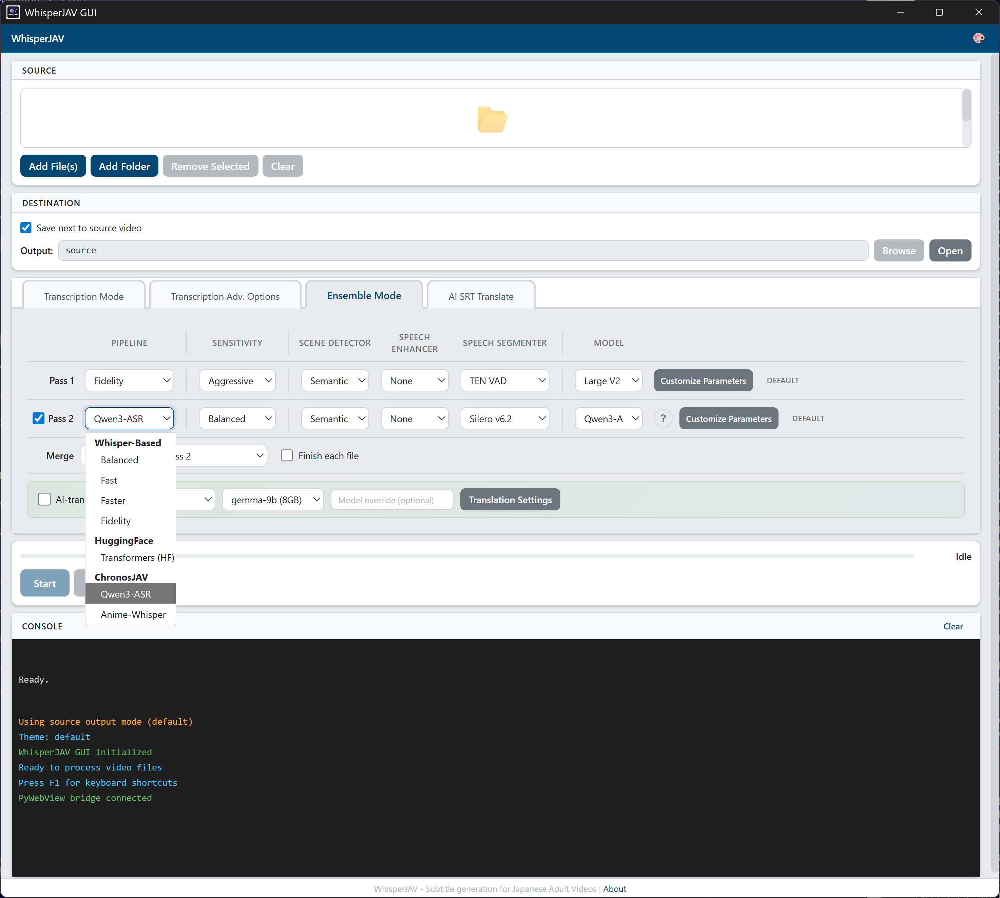
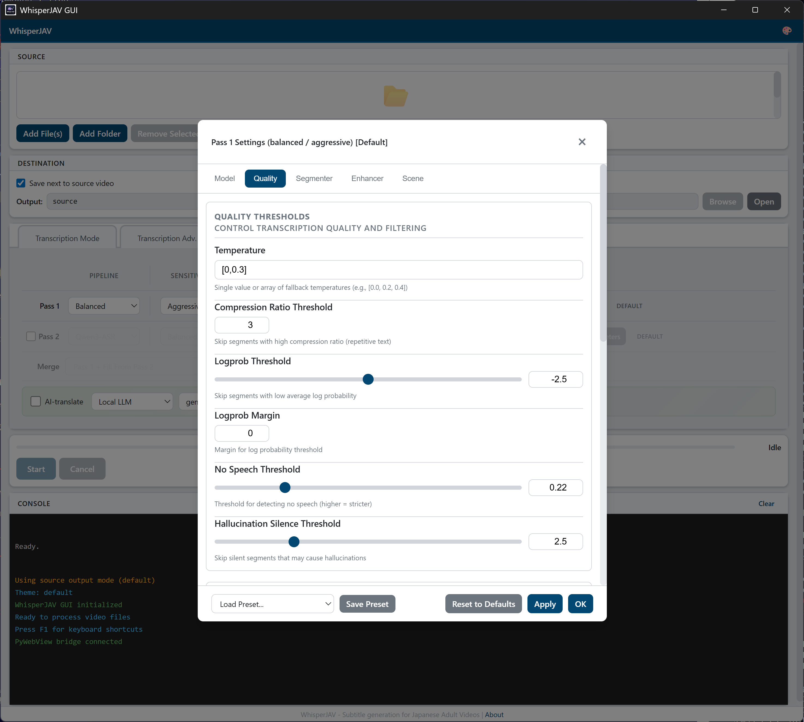
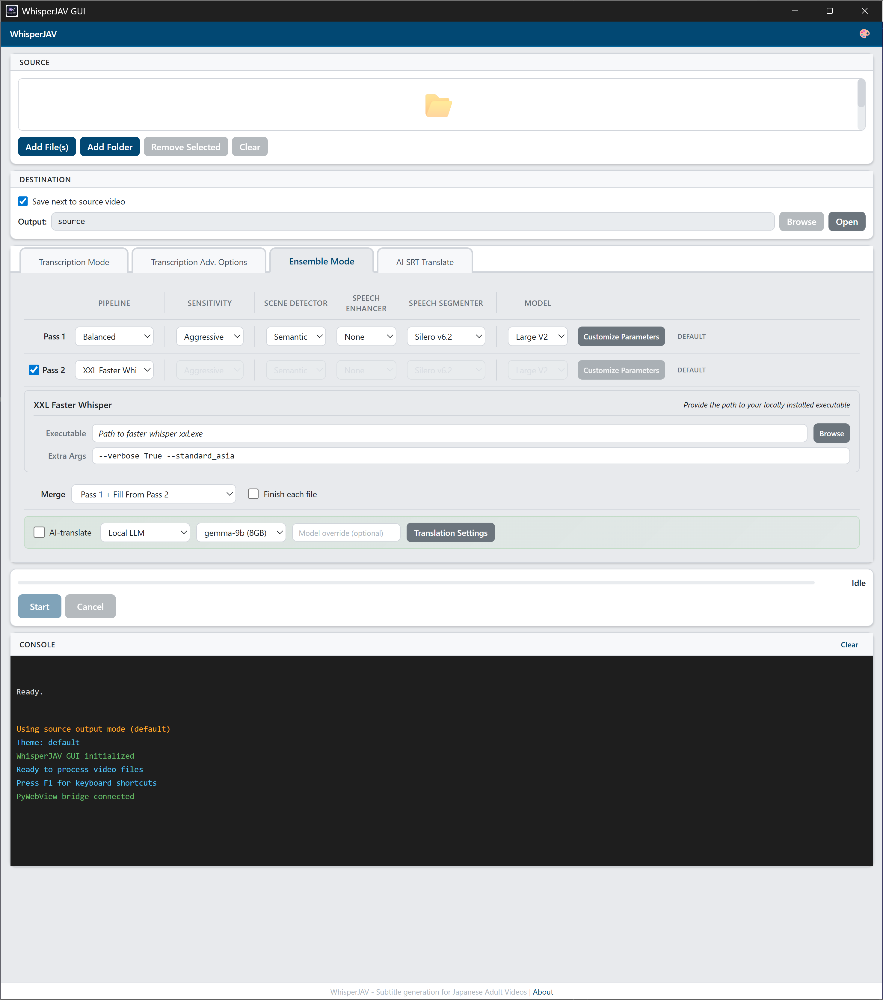

# WhisperJAV GUI User Guide

> Screenshots from v1.8.9 · Windows 11

---

## Table of Contents

1. [Launching the App](#1-launching-the-app)
2. [Interface Overview](#2-interface-overview)
3. [Adding Files](#3-adding-files)
4. [Choosing an Output Location](#4-choosing-an-output-location)
5. [Basic Transcription](#5-basic-transcription)
6. [Advanced Options](#6-advanced-options)
7. [Ensemble Mode (Two-Pass)](#7-ensemble-mode-two-pass)
8. [AI Subtitle Translation](#8-ai-subtitle-translation)
9. [Running a Job](#9-running-a-job)
10. [Console Output](#10-console-output)
11. [Menus & Dialogs](#11-menus--dialogs)
12. [Keyboard Shortcuts](#12-keyboard-shortcuts)
13. [Common Workflows](#13-common-workflows)

{ loading=lazy }

---

## 1. Launching the App

After installation, launch WhisperJAV from:

- **Desktop shortcut** — created automatically by the installer
- **Start menu** — search "WhisperJAV"
- **Command line** — `whisperjav-gui`

On first launch, the app runs a preflight check to verify FFmpeg, CUDA, and Python dependencies are available. Any issues are reported in the console at the bottom of the window.

---

## 2. Interface Overview

The GUI is divided into five areas, top to bottom:

| Area | Purpose |
|------|---------|
| **Header bar** | Theme switcher (4 themes) and update check button |
| **Source** | Add video/audio files to process |
| **Destination** | Where to save output SRT files |
| **Options tabs** | Four tabs of configuration (see sections 5–8) |
| **Run controls & Console** | Progress bar, Start/Cancel, and real-time log output |

### Themes

Click the palette icon in the header to cycle through themes:

| Theme | Description |
|-------|-------------|
| Default | Light theme with blue accents |
| Google | Material Design inspired |
| Carbon | IBM Carbon dark theme |
| Primer | GitHub-style neutral palette |

---

## 3. Adding Files

WhisperJAV accepts video and audio files in any format FFmpeg supports (MP4, MKV, AVI, WAV, MP3, FLAC, M4B, etc.).

### Adding files

- **Drag and drop** files directly onto the file list area
- **Add File(s)** button — opens a multi-select file dialog
- **Add Folder** button — adds all media files from a folder (non-recursive)

Each file appears in the list with its filename and duration.

### Managing the file list

- **Remove Selected** — removes highlighted files from the list
- **Clear** — removes all files

---

## 4. Choosing an Output Location

By default, SRT files are saved next to the source video. Uncheck **"Save next to source video"** to pick a custom output folder.

| Setting | Behavior |
|---------|----------|
| Checked (default) | Output SRT saved in the same folder as each source video |
| Unchecked | All SRT files saved to the chosen output directory |

When unchecked, use **Browse** to select a folder, or **Open** to view it in File Explorer.

---

## 5. Basic Transcription

The **Transcription Mode** tab (Tab 1) controls the core transcription pipeline.

{ loading=lazy }

### Mode

Selects the processing pipeline. Each mode trades speed for accuracy.

{ loading=lazy }

| Mode | Backend | Scene Detection | VAD | Best For |
|------|---------|-----------------|-----|----------|
| **Fidelity** | Whisper | Yes | Full | Maximum accuracy, slow |
| **Balanced** (default) | Whisper | Yes | Yes | General use |
| **Fast** | Whisper | Yes | No | Quick results with scene awareness |
| **Faster** | Faster-Whisper | No | No | Maximum speed, minimal processing |
| **Transformers** | HuggingFace | Yes | Yes | Alternative backend |

### Sensitivity

Controls how aggressively the system detects and segments speech.

| Sensitivity | Description |
|-------------|-------------|
| **Aggressive** (default) | Lower thresholds, captures more speech including quiet passages |
| **Balanced** | Middle ground |
| **Conservative** | Higher thresholds, fewer false positives, may miss quiet speech |

### Source Language

The language spoken in the video. Affects Whisper's language hint and post-processing rules.

- **Japanese** (default) — optimized with Japanese-specific regrouping, particle detection, aizuchi handling
- **Korean**, **Chinese**, **English** — standard Whisper processing

### Subtitle Output

- **Native** (default) — subtitles in the original spoken language
- **Direct-to-English** — Whisper translates to English during transcription (lower quality than dedicated translation)

---

## 6. Advanced Options

The **Advanced** tab (Tab 2) provides additional controls for troubleshooting and fine-tuning.

{ loading=lazy }

| Option | Default | Description |
|--------|---------|-------------|
| **Model override** | Off | When checked, forces a specific Whisper model size instead of the pipeline default |
| **Model** dropdown | Large V3 | Only visible when model override is checked. Options: Large V2, Large V3, Turbo |
| **Output format** | SRT | Output format: SRT, VTT, or Both |
| **Async processing** | Off | Enables asynchronous pipeline execution |
| **Debug logging** | Off | Writes detailed debug logs to `whisperjav.log` |
| **Keep temp files** | Off | Preserves intermediate audio chunks and processing artifacts |
| **Custom temp dir** | System default | When "Keep temp files" is on, optionally choose where to store them |
| **Accept CPU-only mode** | Off | Allows running without CUDA GPU (much slower, but works) |

---

## 7. Ensemble Mode (Two-Pass)

The **Ensemble** tab (Tab 3) lets you run two different pipelines and merge their results for higher accuracy. This is the most powerful mode.

{ loading=lazy }

### How Ensemble Works

1. **Pass 1** processes the video with one pipeline configuration
2. **Pass 2** (optional) processes the same video with a different configuration
3. The two SRT outputs are **merged** using a configurable strategy

This leverages the strengths of different backends — for example, Whisper for timing accuracy and Qwen3-ASR for text quality.

### Pass Configuration

Always active. Each pass has identical controls:

| Control | Options | Default |
|---------|---------|---------|
| **Pipeline** | Balanced, Fast, Faster, Fidelity, Transformers, Qwen3-ASR, ChronosJAV, XXL Faster Whisper | Balanced |
| **Sensitivity** | Aggressive, Balanced, Conservative | Aggressive |
| **Scene Detector** | Auditok, Silero, Semantic, None | Semantic |
| **Speech Enhancer** | None, FFmpeg DSP, ZipEnhancer, ClearVoice, BS-RoFormer | None |
| **Speech Segmenter** | Silero v6.2, v4.0, v3.1, Whisper VAD, TEN, None | Silero v6.2 |
| **Model** | Depends on pipeline — Large V2/V3/Turbo (Whisper) or 1.7B/0.6B (Qwen) | Pipeline default |

### Available Pipelines

The pipeline dropdown groups options by backend:

{ loading=lazy }

- **Whisper-Based**: Balanced, Fast, Faster, Fidelity
- **HuggingFace**: Transformers
- **ChronosJAV**: Qwen3-ASR, Anime-Whisper
- **External (BYOP)**: XXL Faster Whisper (Pass 2 only)

### Customize Parameters

Click the **Customize** button on a pass to open the parameter tuning modal. This gives fine-grained control over model, quality, segmenter, enhancer, scene detection, and context parameters.

{ loading=lazy }

The modal has tabs for **Model**, **Quality**, **Segmenter**, **Enhancer**, and **Scene** settings. A badge shows **DEFAULT** or **CUSTOM** to indicate whether parameters have been modified.

Use **Save Preset** to save your configuration for reuse, or **Load Preset** to restore a saved configuration. Presets persist across sessions.

### Pass 2 Configuration

Check the **Pass 2** checkbox to enable the second pass. Controls are identical to Pass 1.

When disabled, the row is greyed out and all controls are inactive.

### BYOP: XXL Faster Whisper (v1.8.9+)

Select **XXL Faster Whisper** as the Pass 2 pipeline to use [PurfView's Faster Whisper XXL](https://github.com/Purfview/whisper-standalone-win) as an external subprocess. This is a "Bring Your Own Pipeline" (BYOP) feature — you supply the executable, WhisperJAV handles integration.

{ loading=lazy }

| Field | Description |
|-------|-------------|
| **Executable** | Path to your `faster-whisper-xxl.exe`. Click **Browse** to select it. |
| **Extra Args** | Any additional flags to pass to XXL (e.g., `--verbose True --standard_asia`). |

WhisperJAV sends only 4 required args to XXL (input file, output dir, model, language). Everything else is controlled by your Extra Args field. XXL's real-time console output is streamed to the GUI console.

If XXL crashes during shutdown (a known ctranslate2 behavior) but the SRT was already written, WhisperJAV keeps the valid output instead of discarding it.

### Speech Enhancement: FFmpeg DSP

When **FFmpeg DSP** is selected as the speech enhancer, an additional panel appears with 8 audio processing effects:

| Effect | Description |
|--------|-------------|
| Loudness Normalization | Normalize overall loudness to a standard level |
| Dynamic Normalization | Even out volume differences between quiet and loud sections |
| Compression | Reduce dynamic range |
| Denoise | Remove background noise |
| High-pass Filter | Remove low-frequency rumble |
| Low-pass Filter | Remove high-frequency hiss |
| De-esser | Reduce harsh sibilance (s/t sounds) |
| Amplify | Boost overall volume |

### Merge Strategy

When Pass 2 is enabled, choose how the two outputs are combined:

| Strategy | Description |
|----------|-------------|
| **Pass 1 Primary** (default) | Uses Pass 1 as the base, fills gaps from Pass 2 |
| **Smart Merge** | Intelligently selects the best subtitle from each pass based on quality heuristics |
| **Full Merge** | Combines all subtitles from both passes, resolving overlaps |
| **Longest** | Picks the longer (more detailed) subtitle when passes overlap |
| **Pass 2 Primary** | Uses Pass 2 as the base, fills gaps from Pass 1 |
| **Pass 1 Overlap (30%)** | Pass 1 base, requires 30% time overlap to merge from Pass 2 |
| **Pass 2 Overlap (30%)** | Pass 2 base, requires 30% time overlap to merge from Pass 1 |

### Serial Mode

Check **"Finish each file"** to complete each file fully (Pass 1 → Pass 2 → Merge) before starting the next. Useful when processing multiple files — you see results as they finish instead of waiting for the entire batch.

### Inline AI Translation (Ensemble)

Check **"AI-translate"** after the merge strategy to automatically translate the merged output. This shows an inline provider/model selector and a settings button.

---

## 8. AI Subtitle Translation

The **AI SRT Translate** tab (Tab 4) is a standalone tool for translating existing SRT files using AI language models.

{ loading=lazy }

### Provider & Model

| Provider | Notes |
|----------|-------|
| **Ollama** | Local LLM via Ollama. Free, private, no API key needed. Recommended over Local. |
| **Local** | Uses a local LLM server (llama-cpp). Free, private. Legacy — consider Ollama instead. |
| **DeepSeek** | Cloud API. Cost-effective, good quality for CJK languages. |
| **Gemini** | Google's API. Good multilingual support. |
| **Claude** | Anthropic's API. High quality, higher cost. |
| **GPT** | OpenAI's API. Widely available. |
| **OpenRouter** | Meta-router supporting many models. |
| **GLM** | Zhipu AI. Good for Chinese-related tasks. |
| **Groq** | Fast inference cloud provider. |
| **Custom** | Any OpenAI-compatible endpoint. |

Each provider populates a **Model** dropdown with available models. Use **Custom model override** to specify a model ID not in the list.

### API Key & Connection Test

For cloud providers, enter your API key and click **Test Connection** to verify it works. A status icon shows the result.

- Green checkmark: connection successful
- Red X: connection failed (check key and endpoint)

The Local provider does not require an API key — it starts a llama-cpp server automatically.

### Language & Tone

| Setting | Options | Default |
|---------|---------|---------|
| **Source Language** | Japanese, Korean, Chinese | Japanese |
| **Target Language** | English, Chinese, Indonesian, Portuguese, Spanish | English |
| **Tone/Style** | Standard, Adult-Explicit | Standard |

**Standard** tone produces clean, natural translations. **Adult-Explicit** uses specialized instructions tuned for JAV dialogue with appropriate vocabulary.

### Advanced Settings

Click the collapsible **Advanced Settings** section to reveal additional options:

| Setting | Default | Description |
|---------|---------|-------------|
| **Movie Title** | (empty) | Provides context to the AI for better translation |
| **Actress Names** | (empty) | Helps the AI correctly handle character names |
| **Plot Summary** | (empty) | Additional context for the AI translator |
| **Scene Threshold** | 60 sec | How the translator groups subtitles into scenes for batch processing |
| **Max Batch Size** | 30 | Maximum subtitles per translation batch |
| **Max Retries** | 3 | Retry count for failed API calls |
| **Rate Limit** | (provider default) | Requests per minute limit |
| **Custom Endpoint** | (empty) | Override the default API endpoint URL |

### Translation Progress

Translation has its own progress bar and Start/Cancel buttons at the bottom of Tab 4. The main Run Controls section is hidden while Tab 4 is active.

---

## 9. Running a Job

### Starting

1. Add one or more files (Section 3)
2. Configure options on the relevant tab
3. Click **Start**

The progress bar shows overall completion with a percentage. The status label describes the current stage (e.g., "Extracting audio...", "Transcribing scene 3/12...").

### Cancelling

Click **Cancel** to stop the current job. The process terminates and any partial output is preserved.

### When processing is running

- All file selection and configuration controls are **disabled**
- The **Cancel** button becomes active
- Real-time progress appears in both the progress bar and the console

### Completion

When finished, the status shows "Completed" and the SRT file path is printed in the console. The output SRT is ready to use with any media player.

---

## 10. Console Output

The console at the bottom shows real-time log messages from the processing pipeline.

| Color | Meaning |
|-------|---------|
| Green | Success messages (file saved, processing complete) |
| Yellow | Warnings (fallback activated, parameter adjusted) |
| Red | Errors (file not found, CUDA failure) |
| White/Gray | Informational messages (progress, stage transitions) |

Click **Clear** to reset the console output.

---

## 11. Menus & Dialogs

### About Dialog

Press **F1** or access via the header. Shows version info, feature list, and keyboard shortcuts.

### Update Check

WhisperJAV checks for updates automatically on startup (after a 3-second delay). When a new version is available, a subtle indicator appears in the header bar showing the version number. Click it to view the changelog.

For critical updates, a full banner appears at the top of the window.

You can also check manually: click the palette icon in the header, then **Check for Updates**.

### Translation Settings Modal

Accessible from the **Translation Settings** button in the Ensemble tab's AI-translate row. Provides the same configuration as Tab 4 in a compact modal.

{ loading=lazy }

---

## 12. Keyboard Shortcuts

| Shortcut | Action |
|----------|--------|
| **Ctrl+O** | Open file dialog (add files) |
| **Ctrl+R** | Start processing |
| **Escape** | Cancel current job / close dialogs |
| **F1** | Open About dialog |
| **Arrow keys** | Navigate file list |

---

## 13. Common Workflows

### Quick Transcription (Fastest)

1. Drag a video file onto the app
2. Leave defaults (Balanced mode, Aggressive sensitivity, Japanese)
3. Click **Start**
4. SRT appears next to your video file

### High-Quality Transcription (Ensemble)

1. Add files
2. Go to **Ensemble** tab
3. Pass 1: Balanced pipeline, Semantic scene detection (defaults)
4. Enable Pass 2: Select **Qwen3-ASR** pipeline
5. Merge Strategy: **Smart Merge**
6. Click **Start**
7. Two passes run sequentially, then results are merged

### Transcribe + Translate in One Step

1. Add files
2. Go to **Ensemble** tab
3. Configure passes as desired
4. Check **"AI-translate"**
5. Select provider, enter API key if needed
6. Click **Start**
7. Get translated SRT automatically after transcription

### Translate an Existing SRT

1. Go to **AI SRT Translate** tab (Tab 4)
2. Add your SRT file(s)
3. Select provider and model
4. Enter API key and test connection
5. Set target language
6. Click **Start**

### CPU-Only Mode (No GPU)

1. Go to **Advanced** tab
2. Check **"Accept CPU-only mode"**
3. Use **Faster** mode for best speed without GPU
4. Processing will be significantly slower but functional
