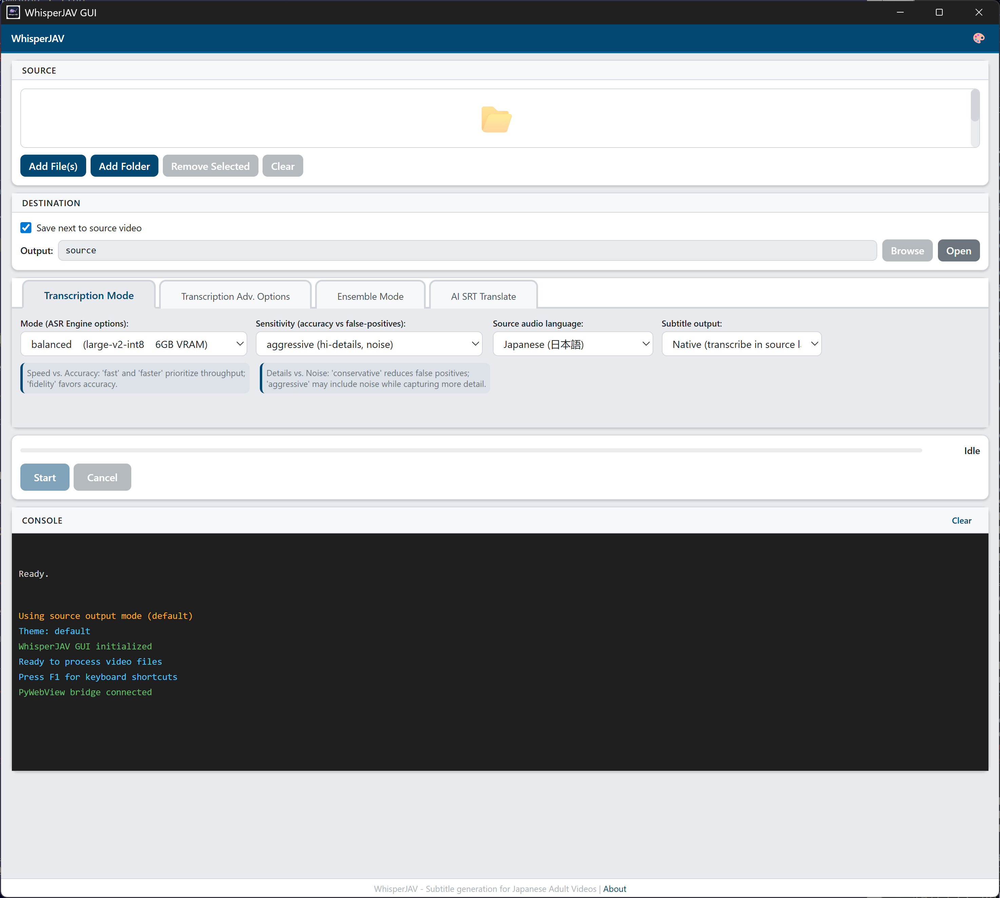
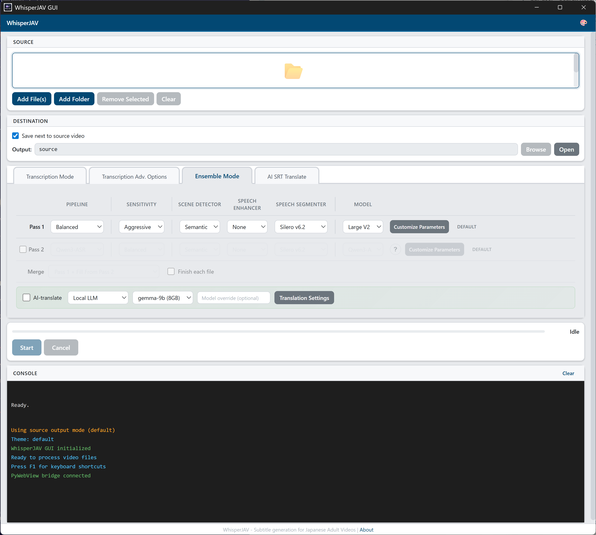
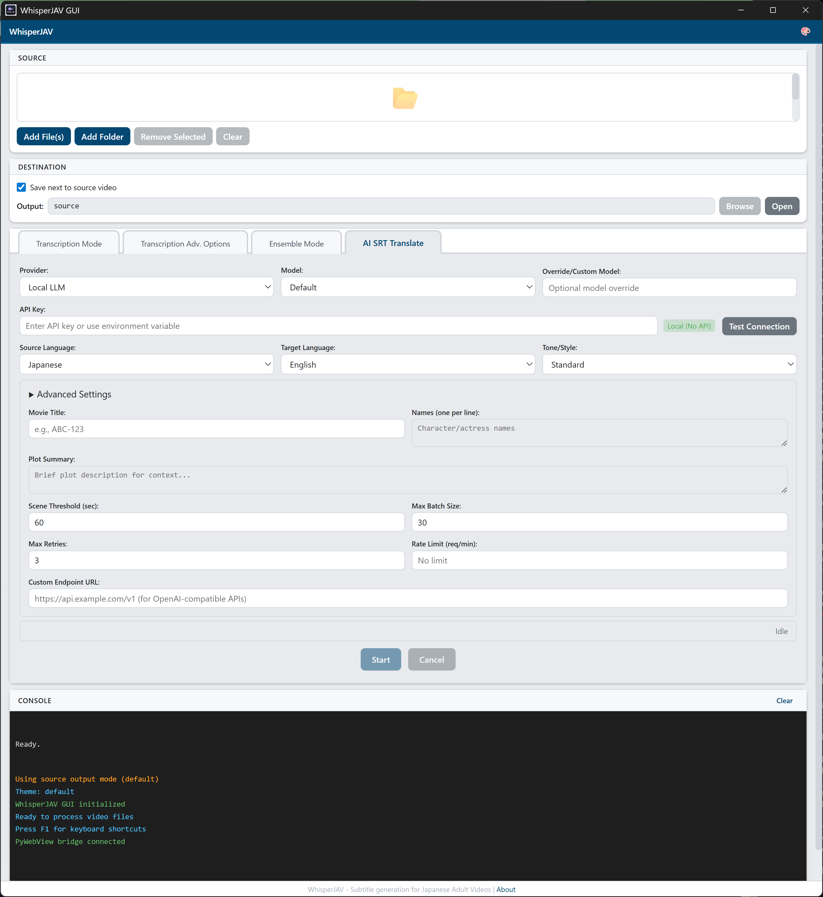
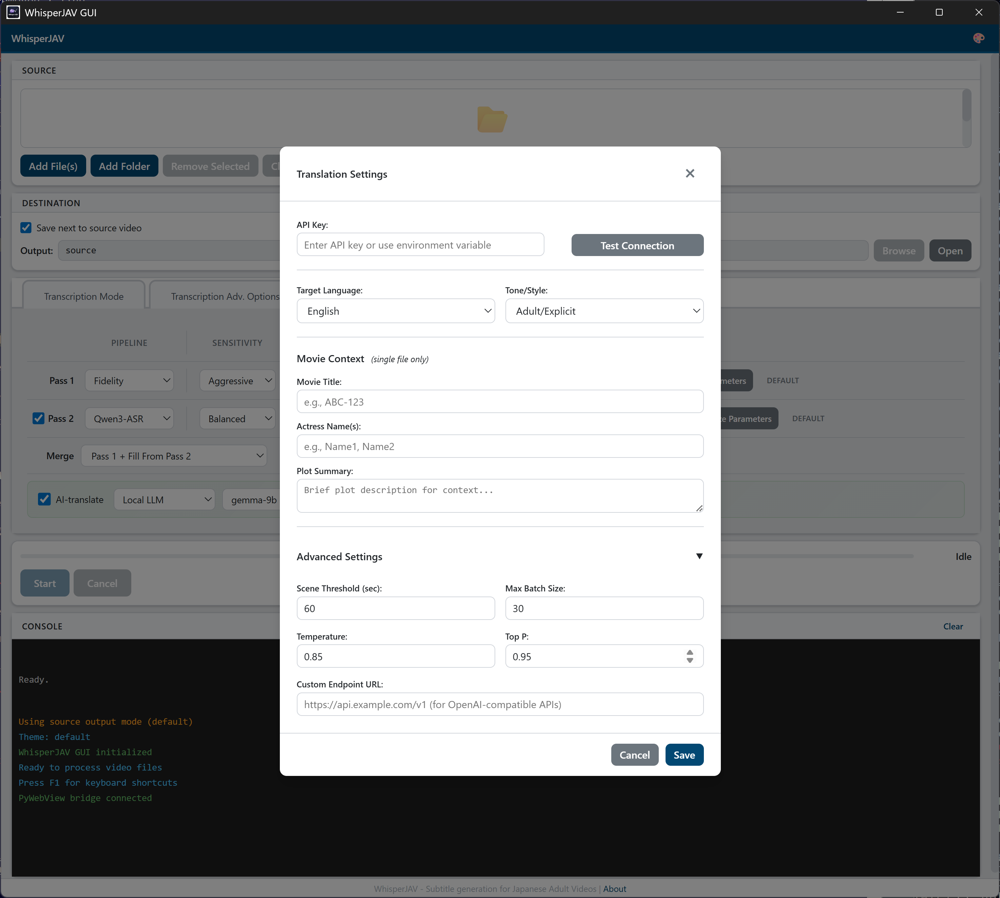

# WhisperJAV GUI 用户指南

> 截图来自 v1.8.9 · Windows 11

---

## 目录

1. [启动应用](#1-启动应用)
2. [界面概览](#2-界面概览)
3. [添加文件](#3-添加文件)
4. [选择输出位置](#4-选择输出位置)
5. [基本转录](#5-基本转录)
6. [高级选项](#6-高级选项)
7. [集成模式（双通道）](#7-集成模式双通道)
8. [AI 字幕翻译](#8-ai-字幕翻译)
9. [运行任务](#9-运行任务)
10. [控制台输出](#10-控制台输出)
11. [菜单与对话框](#11-菜单与对话框)
12. [键盘快捷键](#12-键盘快捷键)
13. [常见工作流程](#13-常见工作流程)

{ loading=lazy }

---

## 1. 启动应用

安装完成后，可以通过以下方式启动 WhisperJAV：

- **桌面快捷方式** — 由安装程序自动创建
- **开始菜单** — 搜索 "WhisperJAV"
- **命令行** — `whisperjav-gui`

首次启动时，应用会执行预检查，验证 FFmpeg、CUDA 和 Python 依赖项是否可用。任何问题都会在窗口底部的控制台中报告。

---

## 2. 界面概览

GUI 从上到下分为五个区域：

| 区域 | 用途 |
|------|------|
| **顶部栏** | 主题切换器（4 种主题）和检查更新按钮 |
| **来源** | 添加要处理的视频/音频文件 |
| **目标** | 设置输出 SRT 文件的保存位置 |
| **选项标签页** | 四个配置标签页（参见第 5-8 节） |
| **运行控制和控制台** | 进度条、开始/取消按钮和实时日志输出 |

### 主题

点击顶部栏中的调色板图标切换主题：

| 主题 | 描述 |
|------|------|
| Default | 蓝色调的浅色主题 |
| Google | Material Design 风格 |
| Carbon | IBM Carbon 深色主题 |
| Primer | GitHub 风格的中性色调 |

---

## 3. 添加文件

WhisperJAV 接受 FFmpeg 支持的任何格式的视频和音频文件（MP4、MKV、AVI、WAV、MP3、FLAC、M4B 等）。

### 添加文件

- **拖放** 文件到文件列表区域
- **Add File(s)** 按钮 — 打开多选文件对话框
- **Add Folder** 按钮 — 添加文件夹中的所有媒体文件（非递归）

每个文件在列表中显示文件名和时长。

### 管理文件列表

- **Remove Selected** — 从列表中移除选中的文件
- **Clear** — 移除所有文件

---

## 4. 选择输出位置

默认情况下，SRT 文件保存在源视频旁边。取消勾选 **"Save next to source video"** 可以选择自定义输出文件夹。

| 设置 | 行为 |
|------|------|
| 勾选（默认） | 输出 SRT 保存在每个源视频所在的文件夹中 |
| 取消勾选 | 所有 SRT 文件保存到指定的输出目录 |

取消勾选后，使用 **Browse** 选择文件夹，或使用 **Open** 在文件资源管理器中查看。

---

## 5. 基本转录

**Transcription Mode** 标签页（标签页 1）控制核心转录处理管线。

{ loading=lazy }

### 模式

选择处理管线。每种模式在速度和精度之间做出不同的权衡。

{ loading=lazy }

| 模式 | 后端 | 场景检测 | 语音活动检测 | 适用场景 |
|------|------|----------|------------|----------|
| **Fidelity** | Whisper | 是 | 完整 | 最高精度，速度较慢 |
| **Balanced**（默认） | Whisper | 是 | 是 | 通用场景 |
| **Fast** | Whisper | 是 | 否 | 具有场景感知的快速转录 |
| **Faster** | Faster-Whisper | 否 | 否 | 最快速度，最少处理 |
| **Transformers** | HuggingFace | 是 | 是 | 替代后端 |

### 灵敏度

控制系统检测和分割语音的激进程度。

| 灵敏度 | 描述 |
|--------|------|
| **激进**（默认） | 较低阈值，捕获更多语音（包括安静段落） |
| **均衡** | 居中水平 |
| **保守** | 较高阈值，误报更少，可能遗漏安静的语音 |

### 源语言

视频中的说话语言。影响 Whisper 的语言提示和后处理规则。

- **日语**（默认） — 针对日语优化，包含日语分组、助词检测、相槌处理
- **韩语**、**中文**、**英语** — 标准 Whisper 处理

### 字幕输出

- **原语言**（默认） — 以原始语言输出字幕
- **直接转英语** — Whisper 在转录过程中翻译为英语（质量低于专门的翻译工具）

---

## 6. 高级选项

**Advanced** 标签页（标签页 2）提供用于故障排除和微调的额外控制。

{ loading=lazy }

| 选项 | 默认值 | 描述 |
|------|--------|------|
| **模型覆盖** | 关闭 | 勾选后，强制使用指定的 Whisper 模型大小，而非处理管线默认值 |
| **模型** 下拉 | Large V3 | 仅在勾选模型覆盖时可见。选项：Large V2、Large V3、Turbo |
| **输出格式** | SRT | 输出格式：SRT、VTT 或两者 |
| **异步处理** | 关闭 | 启用异步处理管线执行 |
| **调试日志** | 关闭 | 将详细调试日志写入 `whisperjav.log` |
| **保留临时文件** | 关闭 | 保留中间音频块和处理产物 |
| **自定义临时目录** | 系统默认 | 开启"保留临时文件"后，可选择存储位置 |
| **接受纯 CPU 模式** | 关闭 | 允许在没有 CUDA GPU 的情况下运行（速度慢很多，但可以工作） |

---

## 7. 集成模式（双通道）

**Ensemble** 标签页（标签页 3）允许运行两个不同的处理管线并合并结果，以获得更高的精度。这是最强大的模式。

{ loading=lazy }

### 集成模式的工作原理

1. **第一通道** 使用一种处理管线配置处理视频
2. **第二通道**（可选）使用另一种配置处理同一视频
3. 两个 SRT 输出通过可配置的策略进行**合并**

这种方式利用了不同后端的优势 — 例如，Whisper 用于时间轴精度，Qwen3-ASR 用于文本质量。

### 通道配置

始终处于活动状态。每个通道具有相同的控制项：

| 控制项 | 选项 | 默认值 |
|--------|------|--------|
| **处理管线** | Balanced、Fast、Faster、Fidelity、Transformers、Qwen3-ASR、ChronosJAV、XXL Faster Whisper | Balanced |
| **灵敏度** | 激进、均衡、保守 | 激进 |
| **场景检测器** | Auditok、Silero、Semantic、None | Semantic |
| **语音增强器** | None、FFmpeg DSP、ZipEnhancer、ClearVoice、BS-RoFormer | None |
| **语音分割器** | Silero v6.2、v4.0、v3.1、Whisper VAD、TEN、None | Silero v6.2 |
| **模型** | 取决于处理管线 — Large V2/V3/Turbo (Whisper) 或 1.7B/0.6B (Qwen) | 处理管线默认值 |

### 可用处理管线

处理管线下拉菜单按后端分组：

{ loading=lazy }

- **基于 Whisper**：Balanced、Fast、Faster、Fidelity
- **HuggingFace**：Transformers
- **ChronosJAV**：Qwen3-ASR、Anime-Whisper
- **外部 (BYOP)**：XXL Faster Whisper（仅第二通道）

### 自定义参数

点击某个通道上的 **Customize** 按钮打开参数调整弹窗。可以对模型、质量、语音分割器、语音增强器、场景检测和上下文参数进行精细控制。

{ loading=lazy }

弹窗包含 **Model**、**Quality**、**Segmenter**、**Enhancer** 和 **Scene** 设置标签页。徽标显示 **DEFAULT** 或 **CUSTOM** 表示参数是否已修改。

使用 **Save Preset** 保存配置以便重用，或使用 **Load Preset** 恢复已保存的配置。预设在会话间持久保存。

### 第二通道配置

勾选 **Pass 2** 复选框启用第二通道。控制项与第一通道相同。

禁用时，该行变灰且所有控制项不可用。

### BYOP：XXL Faster Whisper (v1.8.9+)

选择 **XXL Faster Whisper** 作为第二通道处理管线，以使用 [PurfView 的 Faster Whisper XXL](https://github.com/Purfview/whisper-standalone-win) 作为外部子进程。这是"自带处理管线"（BYOP）功能 — 你提供可执行文件，WhisperJAV 负责集成。

{ loading=lazy }

| 字段 | 描述 |
|------|------|
| **Executable** | `faster-whisper-xxl.exe` 的路径。点击 **Browse** 选择。 |
| **Extra Args** | 传递给 XXL 的额外参数（例如 `--verbose True --standard_asia`）。 |

WhisperJAV 仅向 XXL 发送 4 个必需参数（输入文件、输出目录、模型、语言）。其他一切由 Extra Args 字段控制。XXL 的实时控制台输出会流式传输到 GUI 控制台。

如果 XXL 在关闭时崩溃（这是已知的 ctranslate2 行为），但 SRT 已经写入，WhisperJAV 会保留有效输出而不是丢弃它。

### 语音增强：FFmpeg DSP

选择 **FFmpeg DSP** 作为语音增强器时，会出现一个包含 8 种音频处理效果的附加面板：

| 效果 | 描述 |
|------|------|
| 响度归一化 | 将整体响度归一化到标准水平 |
| 动态归一化 | 平衡安静和响亮段落之间的音量差异 |
| 压缩 | 减小动态范围 |
| 降噪 | 去除背景噪音 |
| 高通滤波器 | 去除低频隆隆声 |
| 低通滤波器 | 去除高频嘶嘶声 |
| 消齿音 | 减少刺耳的齿擦音（s/t 音） |
| 增益 | 提升整体音量 |

### 合并策略

启用第二通道后，选择两个输出的合并方式：

| 策略 | 描述 |
|------|------|
| **Pass 1 Primary**（默认） | 以第一通道为基础，用第二通道填补空缺 |
| **Smart Merge** | 基于质量启发式算法智能选择每个通道的最佳字幕 |
| **Full Merge** | 合并两个通道的所有字幕，解决重叠问题 |
| **Longest** | 当通道重叠时，选择较长（更详细）的字幕 |
| **Pass 2 Primary** | 以第二通道为基础，用第一通道填补空缺 |
| **Pass 1 Overlap (30%)** | 以第一通道为基础，需要 30% 的时间重叠才从第二通道合并 |
| **Pass 2 Overlap (30%)** | 以第二通道为基础，需要 30% 的时间重叠才从第一通道合并 |

### 串行模式

勾选 **"Finish each file"** 以在处理多个文件时，先完整处理每个文件（第一通道 → 第二通道 → 合并），再处理下一个。这样可以在结果出来时立即查看，而不必等待整个批次完成。

### 内联 AI 翻译（集成模式）

勾选合并策略后面的 **"AI-translate"** 以自动翻译合并后的输出。这会显示一个内联的提供商/模型选择器和设置按钮。

---

## 8. AI 字幕翻译

**AI SRT Translate** 标签页（标签页 4）是一个独立工具，用于使用 AI 语言模型翻译现有的 SRT 文件。

{ loading=lazy }

### 提供商和模型

| 提供商 | 说明 |
|--------|------|
| **Ollama** | 通过 Ollama 使用本地大语言模型。免费、隐私、无需 API 密钥。推荐优先于 Local。 |
| **Local** | 使用本地大语言模型服务器 (llama-cpp)。免费、隐私。旧版 — 建议改用 Ollama。 |
| **DeepSeek** | 云端 API。性价比高，CJK 语言质量好。 |
| **Gemini** | Google 的 API。多语言支持好。 |
| **Claude** | Anthropic 的 API。高质量，成本较高。 |
| **GPT** | OpenAI 的 API。广泛可用。 |
| **OpenRouter** | 支持多种模型的元路由器。 |
| **GLM** | 智谱 AI。适合中文相关任务。 |
| **Groq** | 快速推理云提供商。 |
| **Custom** | 任何 OpenAI 兼容的端点。 |

每个提供商会填充一个 **模型** 下拉菜单，列出可用模型。使用 **Custom model override** 指定不在列表中的模型 ID。

### API 密钥和连接测试

对于云提供商，输入你的 API 密钥并点击 **Test Connection** 验证是否有效。状态图标显示结果。

- 绿色勾号：连接成功
- 红色叉号：连接失败（检查密钥和端点）

Local 提供商不需要 API 密钥 — 它会自动启动 llama-cpp 服务器。

### 语言和风格

| 设置 | 选项 | 默认值 |
|------|------|--------|
| **源语言** | 日语、韩语、中文 | 日语 |
| **目标语言** | 英语、中文、印尼语、葡萄牙语、西班牙语 | 英语 |
| **风格** | Standard、Adult-Explicit | Standard |

**Standard** 风格生成干净、自然的翻译。**Adult-Explicit** 使用针对 JAV 对白的专门指令和相应词汇。

### 高级设置

点击可折叠的 **Advanced Settings** 部分展开更多选项：

| 设置 | 默认值 | 描述 |
|------|--------|------|
| **影片标题** | （空） | 为 AI 提供上下文以改善翻译 |
| **演员姓名** | （空） | 帮助 AI 正确处理角色名称 |
| **剧情摘要** | （空） | 为 AI 翻译器提供额外上下文 |
| **场景阈值** | 60 秒 | 翻译器将字幕分组为场景进行批处理的时间间隔 |
| **最大批量大小** | 30 | 每次翻译批处理的最大字幕数 |
| **最大重试次数** | 3 | API 调用失败的重试次数 |
| **速率限制** | （提供商默认值） | 每分钟请求数限制 |
| **自定义端点** | （空） | 覆盖默认 API 端点 URL |

### 翻译进度

翻译有自己的进度条和开始/取消按钮，位于标签页 4 的底部。标签页 4 处于活动状态时，主运行控制区域会隐藏。

---

## 9. 运行任务

### 开始

1. 添加一个或多个文件（第 3 节）
2. 在相应标签页上配置选项
3. 点击 **Start**

进度条显示整体完成百分比。状态标签描述当前阶段（例如"正在提取音频..."、"正在转录场景 3/12..."）。

### 取消

点击 **Cancel** 停止当前任务。进程终止，已有的部分输出会被保留。

### 处理运行时

- 所有文件选择和配置控制项被**禁用**
- **Cancel** 按钮变为可用
- 进度条和控制台显示实时进度

### 完成

完成后，状态显示"Completed"，SRT 文件路径打印在控制台中。输出的 SRT 可以直接在任何媒体播放器中使用。

---

## 10. 控制台输出

底部的控制台显示来自处理管线的实时日志消息。

| 颜色 | 含义 |
|------|------|
| 绿色 | 成功消息（文件已保存、处理完成） |
| 黄色 | 警告（已激活后备方案、参数已调整） |
| 红色 | 错误（文件未找到、CUDA 故障） |
| 白色/灰色 | 信息消息（进度、阶段切换） |

点击 **Clear** 清空控制台输出。

---

## 11. 菜单与对话框

### 关于对话框

按 **F1** 或通过顶部栏访问。显示版本信息、功能列表和键盘快捷键。

### 检查更新

WhisperJAV 在启动时自动检查更新（延迟 3 秒后）。有新版本可用时，顶部栏会出现一个显示版本号的微妙提示。点击可查看更新日志。

对于关键更新，窗口顶部会出现一个完整的横幅。

也可以手动检查：点击顶部栏中的调色板图标，然后选择 **Check for Updates**。

### 翻译设置弹窗

可从 Ensemble 标签页 AI 翻译行中的 **Translation Settings** 按钮访问。以紧凑的弹窗形式提供与标签页 4 相同的配置。

{ loading=lazy }

---

## 12. 键盘快捷键

| 快捷键 | 操作 |
|--------|------|
| **Ctrl+O** | 打开文件对话框（添加文件） |
| **Ctrl+R** | 开始处理 |
| **Escape** | 取消当前任务 / 关闭对话框 |
| **F1** | 打开关于对话框 |
| **方向键** | 浏览文件列表 |

---

## 13. 常见工作流程

### 快速转录（最快）

1. 将视频文件拖放到应用中
2. 保持默认设置（Balanced 模式、激进灵敏度、日语）
3. 点击 **Start**
4. SRT 文件出现在视频文件旁边

### 高质量转录（集成模式）

1. 添加文件
2. 进入 **Ensemble** 标签页
3. 第一通道：Balanced 处理管线、Semantic 场景检测（默认）
4. 启用第二通道：选择 **Qwen3-ASR** 处理管线
5. 合并策略：**Smart Merge**
6. 点击 **Start**
7. 两个通道依次运行，然后合并结果

### 一步完成转录和翻译

1. 添加文件
2. 进入 **Ensemble** 标签页
3. 按需配置通道
4. 勾选 **"AI-translate"**
5. 选择提供商，如需要则输入 API 密钥
6. 点击 **Start**
7. 转录完成后自动获取翻译好的 SRT

### 翻译已有的 SRT

1. 进入 **AI SRT Translate** 标签页（标签页 4）
2. 添加你的 SRT 文件
3. 选择提供商和模型
4. 输入 API 密钥并测试连接
5. 设置目标语言
6. 点击 **Start**

### 纯 CPU 模式（无 GPU）

1. 进入 **Advanced** 标签页
2. 勾选 **"Accept CPU-only mode"**
3. 使用 **Faster** 模式以获得无 GPU 时的最佳速度
4. 处理速度会明显变慢，但功能正常
